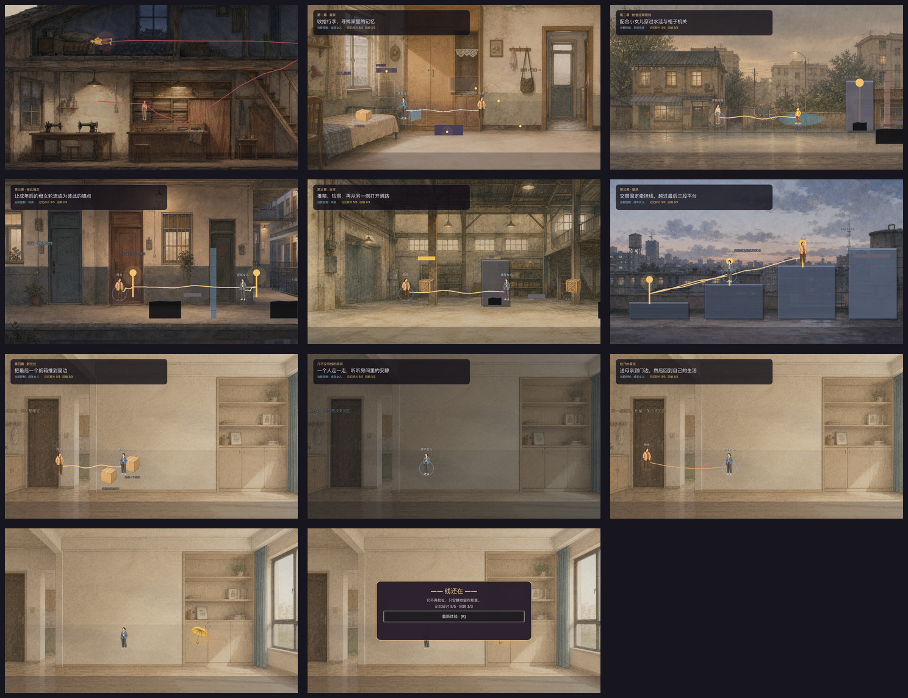

# 《不断线》游戏完成度审计

审计日期：2026-08-27

审计范围：序章、四幕主流程、尾声、全部 16 条剧情需求、D001–D040 对白、牵挂线五种状态、16 张运行时图片、键盘/鼠标输入、暂停与完成界面、声音和减少动态效果设置。

## 结论

- 可玩叙事 Demo 完成度：**92%**。故事、关卡、互动、状态转换和结局已经完整贯通，适合作为完整试玩版或垂直切片。
- 正式发行准备度：**68%**。当前主要缺口是角色动作与表情、机关最终美术、正式音频、导出预设与发行包、更多设备和辅助技术验证。
- 本次自动结果：**154/154 项完成度检查通过，80 项完整流程断言通过，15 张运行状态截图成功生成。**



## 分项完成度

| 维度 | 完成度 | 当前证据 | 主要缺口 |
|---|---:|---|---|
| 剧情与对白 | 100% | SR-001–SR-016、D001–D040、序章至尾声全部路由 | 正式配音未制作 |
| 核心玩法 | 95% | 探索、收集、切换角色、显线、承重、攀回、锚定、推箱、钻洞全部可完成 | 仍是零失败 Demo，未做难度分层 |
| 视觉呈现 | 78% | 4 个角色版本、7 个环境、5 个关键道具已接入 | 角色为静态帧；锚点、门闸与平台仍是半程序化造型 |
| UX 与可访问性 | 86% | 键盘/鼠标互动、焦点、44 px 按钮、静音、减少动态效果、暂停菜单 | 未做按键重映射、文字缩放和屏幕阅读器验证 |
| 音频 | 55% | 9 组程序化环境情绪、7 类反馈音、静音设置 | 没有录制或授权的环境音、拟音与音乐成品 |
| 工程与发行 | 65% | Compatibility Renderer、自动完成度检查、完整流程回归、截图审计 | 缺少导出预设、发行构建、代码 CI 和低配设备性能验证 |

## 流程步骤与健康状态

1. **序章 · 缝纫铺：健康。** 年轻母亲、熟睡女儿和红线的空间关系已经可见；红线从日常缝纫区经楼梯延伸到楼上床铺。
2. **第一幕 · 离家：健康。** 三个核心调查、五个碎片、三个回响、显线、回弹、承重和黄伞入口均可完成；场景标签已补深色描边。
3. **对白与暂停：健康。** 对白层级清楚；暂停菜单支持鼠标和键盘焦点，声音与减少动态效果可持久化。开发调试提示已从暂停页移除。
4. **第二幕 · 雨中记忆：基本健康。** 自行车、水坑、快递柜、锚点、坠落和主动攀回完整；机关结构仍需最终美术替换。
5. **第三幕 · 成年合作：基本健康。** 楼道、仓库和天台三段全部可完成；平台、缺口和门闸已从纯色灰盒改成半透明分层结构，但仍属于中等保真度。
6. **第四幕 · 新住处：健康。** 搬箱、冲突、Silent、独处、Stable 和送母亲到门边完整；沉默状态已改为全房间一致降温，不再出现矩形遮罩接缝。
7. **尾声与完成页：健康。** 纯观赏镜头隐藏玩家光环和身份标签；完成页提供可点击、可聚焦的重新体验按钮。

## 本轮已修正

- 补回序章缺失的年轻母亲和熟睡女儿，并重排红线揭示路径。
- 提升世界标签和角色身份文字的背景对比度。
- 统一楼道缺口、仓库窄道、门闸和天台平台的分层、边缘和透明度。
- 让第四幕 Silent 状态使用无接缝的全房间色调变化。
- 尾声隐藏玩法专用光环和标签。
- 完成页加入鼠标/键盘均可操作的重新体验按钮并自动聚焦。
- 新增 `completion_audit.gd` 和 `scripts/audit_game.sh`，把素材、剧情范围、输入、按钮尺寸、焦点和完整流程纳入一次性检查。

## 仍需继续优化

优先级 P1：

- 制作四个角色的 idle / walk / concern / relieved 动作或表情帧。
- 用正式素材替换锚点、压力板、门闸、屋顶平台和黑色落差。
- 制作或采购可明确授权的环境音、拟音和音乐，并保留当前动态混音接口。
- 添加桌面导出预设、版本信息、图标和可安装构建。

优先级 P2：

- 增加按键重映射、文字大小设置和更明确的色觉无关状态提示。
- 在至少一台低配设备上检查帧率、显存与长时间运行。
- 为正式发行补充辅助技术、手柄和窗口缩放验证。

## 自动复查

```bash
scripts/audit_game.sh /tmp/echoes-of-us-completion-audit
```

该命令会运行素材与实现检查、从序章推进到尾声的完整回归、15 张流程截图和总览图生成。无图形环境可使用：

```bash
ECHOES_SKIP_CAPTURE=1 scripts/audit_game.sh /tmp/echoes-of-us-completion-audit
```

## 证据限制

- 截图可以检查层级、裁切、对比风险和状态表达，但不能证明完整 WCAG 合规。
- 自动测试能证明流程与状态可达，不能替代真人试玩对节奏、情绪和难度的判断。
- 本次没有生成正式导出包，也没有完成低配设备、手柄或屏幕阅读器测试。
